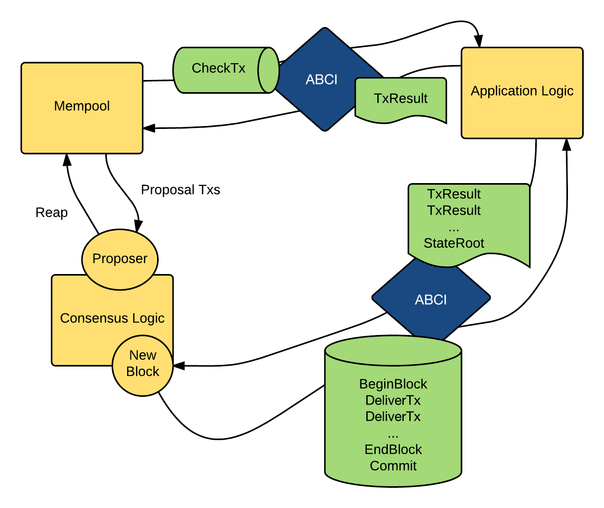

# Tendermint Practice

## 编译
```
git clone git@github.com:ssuchichen/tendermint.git
cd tendermint
make build # build目录下会生成可执行文件tendermint
```

## 什么是Tendermint？
Tendermint is software for securely and consistently replicating an application on many machines.  
Tendermint是用于在许多机器上安全、一致地复制应用程序的软件。
* **安全性**  
多达1/3的机器以任意方式出现故障，Tendermint也能正常工作。
* **一致性**  
每台无故障的机器都会看到相同的事务日志并计算相同的状态。

## Tendermint组成
Tendermint consists of two chief technical components: a blockchain consensus engine and a generic application interface.
* **Tendermint Core**  
确保在每台机器上以相同的顺序记录相同的事务。
* **Application BlockChain Interface (ABCI)**  
允许用任何编程语言处理事务。

## Tendermint的作用
构建需要状态复制的应用，如区块链、分布式存储等。

## ABCI
Tendermint Core(共识引擎)通过满足ABCI的套接字协议与应用程序通信（应用程序实现了ABCI的接口）。
### 假如用Tendermint实现区块链的功能
Tendermint Core需要做:  
* 要在节点间传播区块和交易
* 建立规范(不可变)的交易顺序

Application需要做:  
* 维护存放交易的数据库
* 验证交易签名
* 防止双花
* 查询交易
### ABCI Message
* **DeliverTx**  
  区块链中每笔交易都是通过DeliverTx传递的。应用程序对于每笔收到的交易都要验证。如果合法，就更新应状态。
* **CheckTx**  
  类似于DeliverTx，但它仅用于验证交易。Tendermint Core的mempool首先使用CheckTx检查交易的合法性，并且只将合法交易传递到其他节点。
* **Commit**  
  Commit消息用于计算对当前应用程序状态的加密承诺(cryptographic commitment)，以放入下一个区块头。



## Consensus Overview


